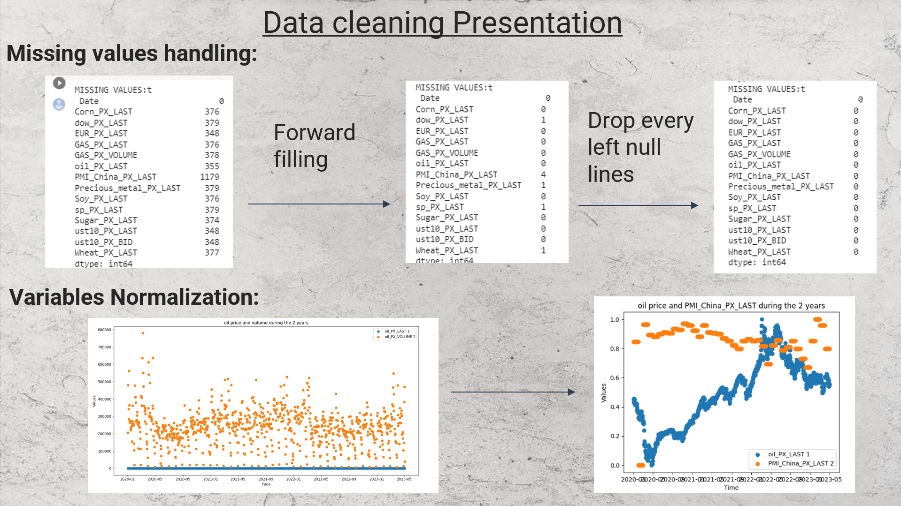
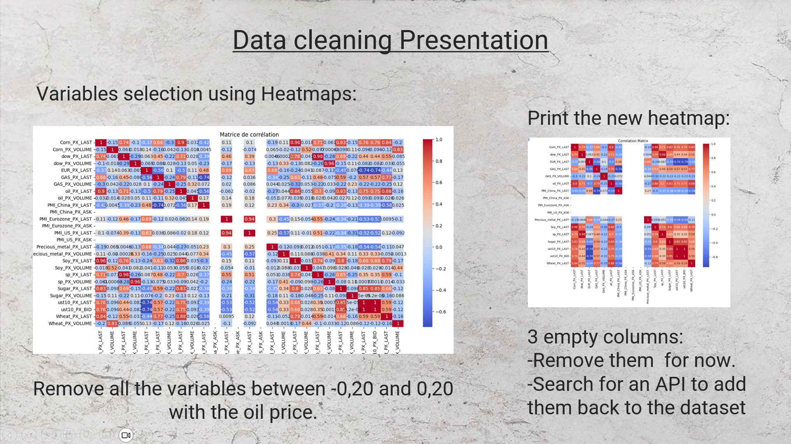
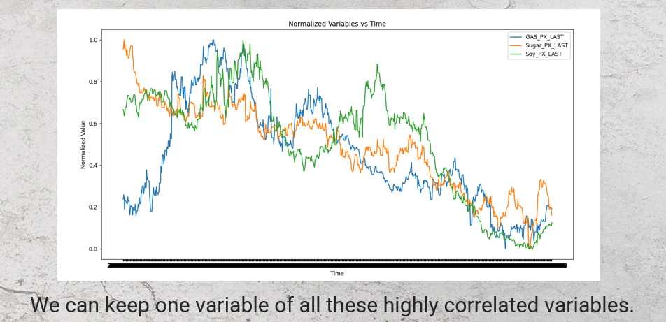
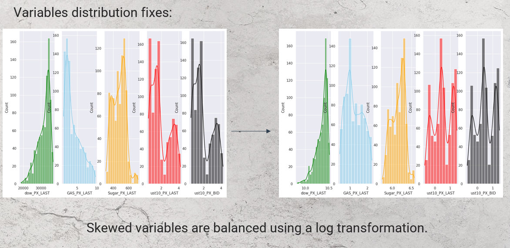
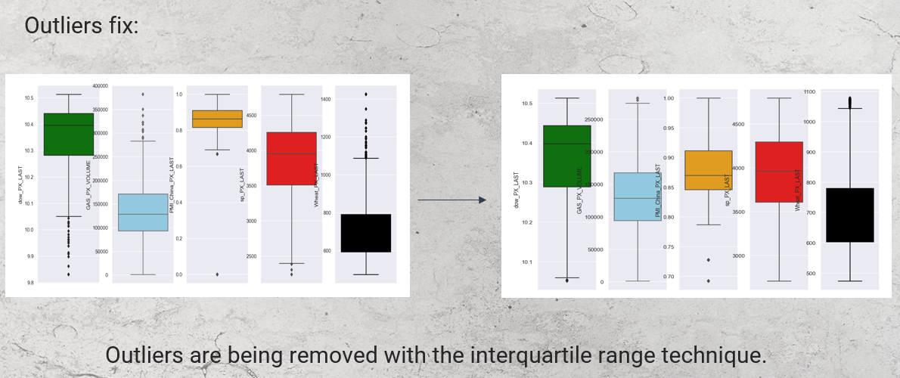
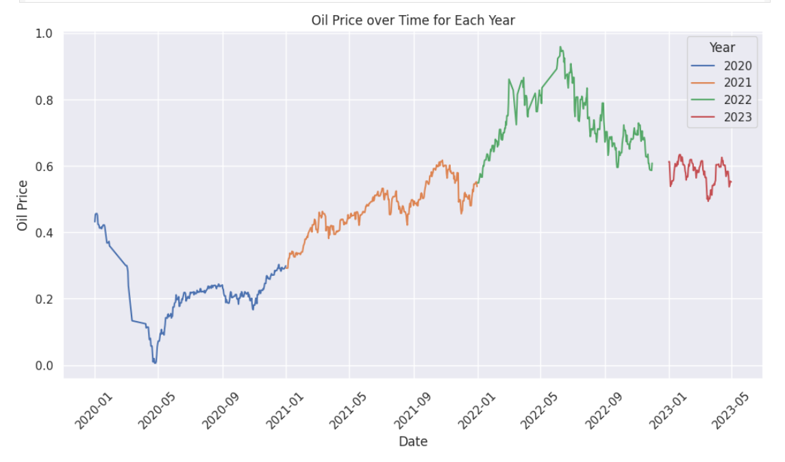
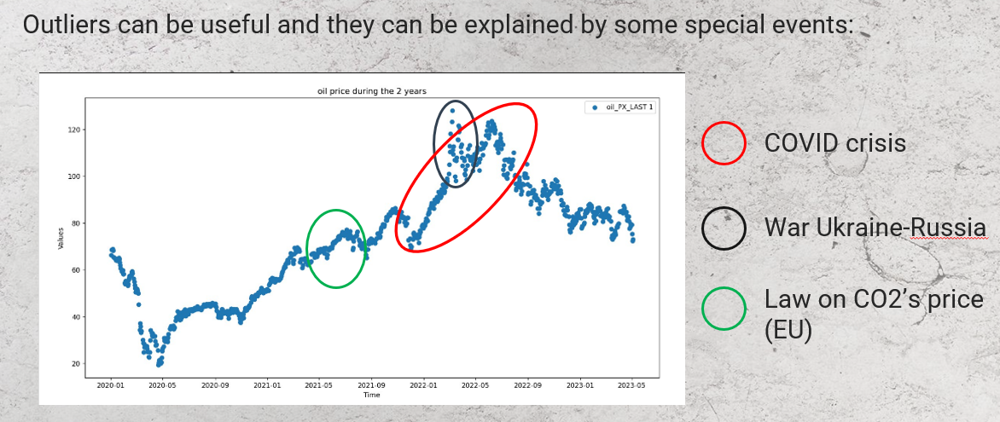
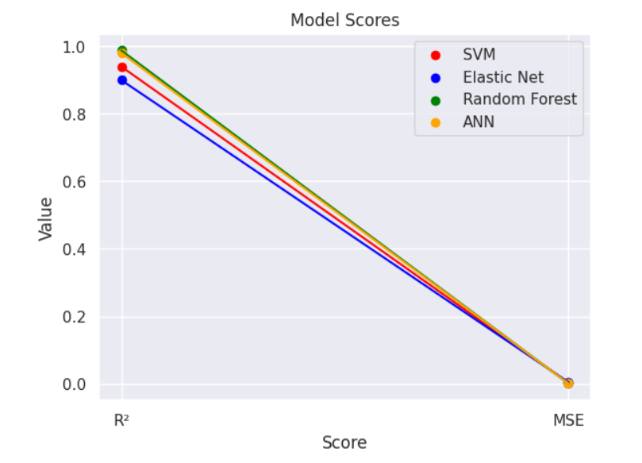

# 👋 Hi, this is a Data scientist project !

🛢️ We wanted to predict the oil price with an existing database. We went through all the basic steps: 
-Define the goal 
-Collect and clean the data 
-Construct hypothesis with data visualization 
-Construct the models 
-Present the results and adapt 

💲💲 After this cycles, we tried to add more data, always in order to improve the efficiency of the tested models/

# 🤓 Tech stack

# Very fast summary !
🧹 1st step: Clean the Data  
  
 
  
 
 

👀 2nd step: Data visualization  
 
 

📠3rd step: Construct the models. We chose Elastic Net, SVM, Random Forest and ANN.  

📈 4th step: Present the results: 
 

